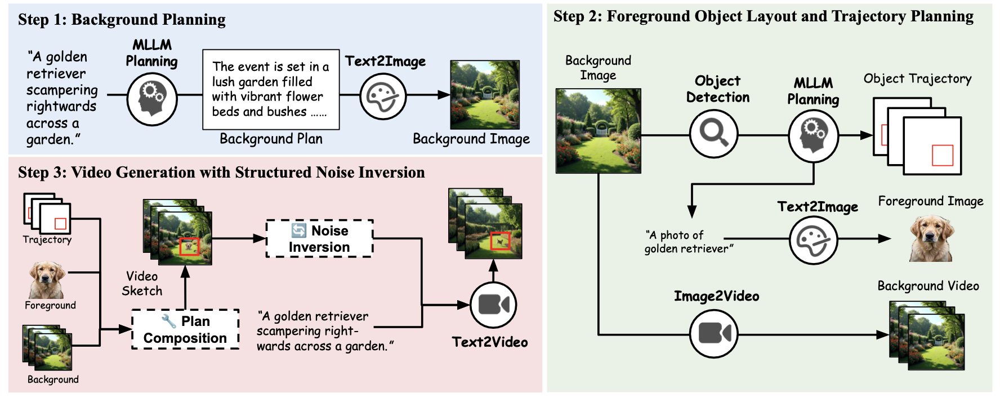

# Training-free Guidance in Text-to-Video Generation via Multimodal Planning and Structured Noise Initialization

* Authors: [Jialu Li](https://jialuli-luka.github.io/)\*, [Shoubin Yu](https://yui010206.github.io/)\*, [Han Lin](https://hl-hanlin.github.io/)\*, [Jaemin Cho](https://j-min.io/), [Jaehong Yoon](https://jaehong31.github.io/) and [Mohit Bansal](https://www.cs.unc.edu/~mbansal/) (UNC Chapel Hill)

* [Paper](https://arxiv.org/abs/2504.08641)

Recent advancements in text-to-video (T2V) diffusion models have significantly enhanced the visual quality of the generated videos. However, even recent T2V models find it challenging to follow text descriptions accurately, especially when the prompt requires accurate control of spatial layouts or object trajectories. A recent line of research uses layout guidance for T2V models that require fine-tuning or iterative manipulation of the attention map during inference time. This significantly increases the memory requirement, making it difficult to adopt a large T2V model as a backbone. To address this, we introduce Video-MSG, a training-free Guidance method for T2V generation based on Multimodal planning and Structured noise initialization. Video-MSG consists of three steps, where in the first two steps, Video-MSG creates Video Sketch, a fine-grained spatio-temporal plan for the final video, specifying background, foreground, and object trajectories, in the form of draft video frames. In the last step, Video-MSG guides a downstream T2V diffusion model with Video Sketch through noise inversion and denoising. Notably, Video-MSG does not need fine-tuning or attention manipulation with additional memory during inference time, making it easier to adopt large T2V models. Video-MSG demonstrates their effectiveness in enhancing text alignment with multiple T2V backbones (VideoCrafter2 and CogVideoX-5B) on popular T2V generation benchmarks (T2VCompBench and VBench). We provide comprehensive ablation studies about noise inversion ratio, different background generators, background object detection, and foreground object segmentation.

<p align="center">

</p>


## Environment Setup 

1. Setup image generation and video generation environments. 

```
pip install -r requirements.txt
```

2. Setup Grounded-Segment-Anything environments.

```
git clone https://github.com/IDEA-Research/Grounded-Segment-Anything.git

cd Grounded-Segment-Anything
export AM_I_DOCKER=False
export BUILD_WITH_CUDA=True
export CUDA_HOME=/path/to/cuda-11.3/

python -m pip install -e segment_anything

pip install --no-build-isolation -e GroundingDINO

git clone https://github.com/xinyu1205/recognize-anything.git
pip install -r ./recognize-anything/requirements.txt
pip install -e ./recognize-anything/
```

## Stage1: Background Planning

1. Generate background description with LLM

```
python background_planning/llm_plan.py \
  --api_key OpenAI key here \
  --prompt_path T2V-CompBench \
  --output_file background_plan.json 
```

* `api_key`: OpenAI API key. 

* `prompt_path`: Path to text file of prompts. 

* `output_file`: Path to save the output plan.


2. Generate Background Images with SDXL or FLUX

```
CUDA_VISIBLE_DEVICES=0 python background_planning/bg_gen.py \
  --plan_path background_plan.json \
  --output_path background_images_flux \
  --generator flux 
```

* `plan_path`: Path to the background planning JSON file.

* `output_path`: Path to the output background images directory.

* `generator`: Selection from [`flux`, `sdxl`].


4. Animate Background Image with CogVideo5B-I2V 

```
CUDA_VISIBLE_DEVICES=0 python background_planning/bg_animate.py \
  --plan_path background_plan.json \
  --output_path background_videos_flux \
  --input_background_path background_images_flux 
```

* `plan_path`: Path to the background planning JSON file.

* `output_path`: Output directory for generated videos.

* `input_background_path`: Path to background images.


## Stage2: Foreground Object Layout and Trajectory Planning

1. Detect all the objects in the background image with RAM + SAM. Replace the file `automatic_label_ram_demo.py` under `Grounded-Segment-Anything` with the file provided under `foreground_planning`.

```
CUDA_VISIBLE_DEVICES=0 python automatic_label_ram_demo.py \
  --config GroundingDINO/groundingdino/config/GroundingDINO_SwinT_OGC.py \
  --ram_checkpoint ram_swin_large_14m.pth \
  --grounded_checkpoint groundingdino_swint_ogc.pth \
  --sam_checkpoint sam_vit_h_4b8939.pth \
  --input_path background_images_flux \
  --output_dir background_images_flux_output \
  --box_threshold 0.25 \
  --text_threshold 0.2 \
  --iou_threshold 0.5 \
  --device "cuda"
```

* `input_path`: Path to background images.

* `output_dir`: Output directory for annotated background images.

2. Generate foreground object planning with LLM. 

```
python foreground_planning/llm_plan.py \
  --api_key OpenAI key here \
  --prompt_path T2V-CompBench \
  --output_file object_plan.json \
  --background_image_annotation background_images_flux_output 
```

* `api_key`: OpenAI API key. 

* `prompt_path`: Path to text file of prompts. 

* `output_file`: Path to save the output plan. 

* `background_image_annotation`: Path to the background images with bounding box annotation.


3. Video sketch generation with SDXL or Flux

```
CUDA_VISIBLE_DEVICES=0 python foreground_planning/video_sketch_gen.py \
  --plan_path object_plan.json \
  --output_path video_sketch_flux \
  --input_background_video_path background_videos_flux \
  --generator flux 
```

* `plan_path`: Path to the foreground object planning JSON file.

* `output_path`: Output directory for generated video sketch.

* `input_background_video_path`: Path to background videos.

* `generator`: Selection from [`flux`, `sdxl`].


## Stage3: Video Generation with Structured Noise Initialization

1. Generate videos with the video sketch as condition in noise initialization 

```
CUDA_VISIBLE_DEVICES=0 python video_generation/video_generation.py \
  --prompt_path T2VCompBench
  --latent_path video_sketch_flux \
  --output_path outputs \
  --skill_name 4_motion_binding \
  --noise_steps 699
```

* `prompt_path`: Path to input prompt

* `latent_path`: Path to video sketch

* `output_path`: Output directory for generated videos

* `skill_name`: Skill to generation (e.g., `4_motion_binding`)

* `noise_steps`: How much noise to inject in the video sketch (e.g., `699` indicates `α=0.7`)


## Citation

If you find this work useful, please consider citing:

```bibtex
@inproceedings{li2025video-msg,
  title     = {Training-free Guidance in Text-to-Video Generation via Multimodal Planning and Structured Noise Initialization},
  author    = {Jialu Li*, Shoubin Yu*, Han Lin*, Jaemin Cho, Jaehong Yoon, Mohit Bansal},
  booktitle = {arxiv},
  year      = {2025},
  url       = {https://arxiv.org/abs/2504.08641}
}
```
